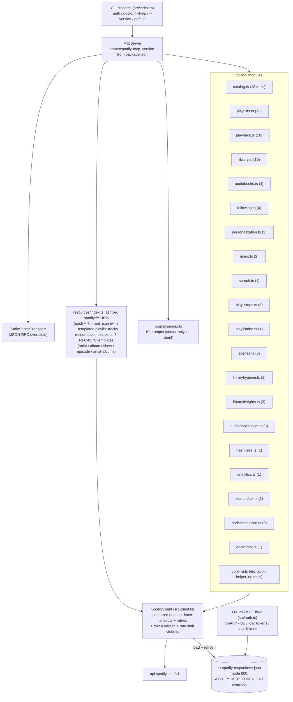
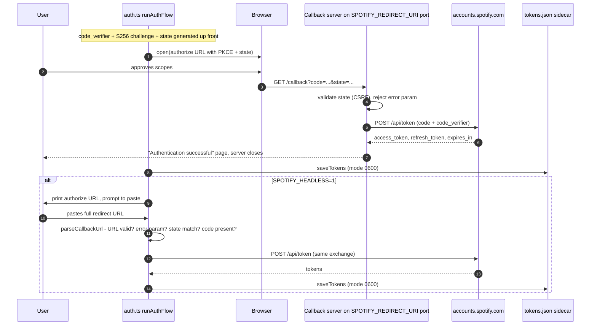

# Architecture

How SpotifyMCP actually works, distilled from the source under `src/`. For the *what* (goals, contracts, full endpoint inventory), read [SPEC.md](SPEC.md); this document is the how-it-works companion and cross-references the spec where relevant.

## Component map

`index.ts` wires everything at startup: it creates one `SpotifyClient`, passes that single shared instance to every active tool module and to the resource/prompt registrars, then connects a `StdioServerTransport`. Each module registration is gated twice (#111): by the resolved **toolset** (`SPOTIFY_MCP_TOOLSETS`, with per-key `SPOTIFY_MCP_ENABLE_TOOLS`/`SPOTIFY_MCP_DISABLE_TOOLS` overrides on top — disable beats enable beats set; unknown names are warned about and ignored) and by a **scope gate** (`src/scopefilter.ts`): modules whose write scopes were never granted at auth time (scopes are persisted on `tokens.json`) are hidden entirely instead of failing at call time; read-only modules are never blocked. The one exception is `spotify_doctor` (`doctortool.ts`), which registers unconditionally so diagnostics survive toolset trimming. `SPOTIFY_MCP_READONLY=1` hides every write-capable module regardless of scopes. Mutating tools can verify their writes landed via receipts (`src/receipts.ts`, exposed as the `verify_receipt` tool in `index.ts`). A pagination-progress forwarder still turns client page-walk events into MCP progress notifications. Running `spotify-mcp auth` instead runs `runAuthFlow()` from `auth.ts` and exits; `spotify-mcp doctor` builds a short-lived cache-disabled client to check config, token state, and live API access.

## Authentication flows

Both flows share the same PKCE primitives (`code_verifier` = base64url of 32 random bytes, `S256` challenge, random 16-byte `state`) and the same token exchange against `https://accounts.spotify.com/api/token`. The redirect URI defaults to `http://127.0.0.1:8888/callback`; `SPOTIFY_REDIRECT_URI` overrides it, and the callback server's bind port and route path are **derived from that value** (#14), so an override such as `http://127.0.0.1:9000/callback` is honoured end-to-end.

The headless branch exists because the callback listener binds `127.0.0.1` on the machine running the MCP server — useful when that machine is remote (homelab, CI, agent runtime) and the operator's browser is elsewhere. `parseCallbackUrl` is a pure exported function so the state/error/code validation is unit-testable without network. When the browser flow rejects a callback carrying an OAuth `error` param, the failure page interpolates that value through `escapeHtml` before echoing it back (#19), so a crafted redirect cannot inject markup.

Tokens live in `~/.spotify-mcp/tokens.json` by default (`SPOTIFY_MCP_TOKEN_FILE` overrides it). Writes are atomic: `saveTokens` writes a `.tmp` sidecar with mode `0o600` and renames it over the target (#109), so a crash mid-write cannot leave a truncated file; granted OAuth scopes are persisted on the token object for the scope gates in `index.ts`.

## Request pipeline

Every HTTP call funnels through one private path inside `SpotifyClient`:
1. **Serialization (two-lane)** — `get`/`post`/`put`/`putRaw`/`delete` wrap their work in `enqueue()`, which lands the task on one of two priority lanes (`normal` for interactive calls, `low` for `getAllPages` walks — see [Request scheduling](#request-scheduling)). Requests are still issued strictly one at a time; a rejection is swallowed when re-linking the chain so one failure cannot poison subsequent calls.
2. **Inter-request gap** — before each request fires, the worker sleeps until at least 100 ms have passed since the previous request started.
3. **Rate-limit hold** — after any 429, `_rateLimitUntil` is set to now + `Retry-After` seconds; every later queued request additionally waits out that deadline. The `Retry-After` header is parsed defensively: absent *or* unparsable values fall back to 1 s, so garbage can no longer poison the deadline with `NaN`. The response body's `error.reason` is inspected: `QUOTA_EXCEEDED` throws immediately (with the quota message), and bursts with `Retry-After` > 10 s fail fast with the wait surfaced in the error; only small bursts are slept off in-queue (`_lastThrottle`) and retried once. Every throttle event is recorded as `_lastThrottle` (`retryAfterSec`, `waitedMs`, timestamp) and surfaced read-only via the `spotify://me/rate-limit` resource, so agents can make informed wait-vs-abort decisions without burning another tool call.
4. **Token freshness** — the token file is read once per client and memoised on a cached promise; a failed load is deliberately *not* memoised, so the next call retries from disk (e.g. after the user re-runs `spotify-mcp auth`). `ensureValidToken()` proactively refreshes when `Date.now()` is within 60 s of `expires_at`. If a call nonetheless comes back **401**, the client refreshes and retries exactly once. `doRefreshTokens` first re-reads the token file and adopts a fresher sidecar written by another process (#109); otherwise it refreshes using the stored `refresh_token`, persisting a rotated one if Spotify issues it. Malformed `expires_in` is treated as already expired so a dead token never sticks. Refresh failure throws `SpotifyApiError` with the message `Token refresh failed — re-run "spotify-mcp auth"` for revoked grants; transient outages ride out on a still-valid access token.
5. **Fetch timeout** — every outbound call (API requests and the token-exchange/refresh calls alike) carries an `AbortSignal.timeout`, defaulting to 30 s and overridable via `SPOTIFY_REQUEST_TIMEOUT_MS`. An aborted call surfaces as `SpotifyApiError` ("`<METHOD> <url>` timed out after Ns") instead of hanging its queue slot indefinitely.
6. **Error model** — non-OK responses throw `SpotifyApiError(status, message)` where the message prefers Spotify's own `error.message` from the JSON body verbatim (e.g. "Player command failed: Premium required"). Only when the body is missing, lacks `message`, or isn't JSON does it fall back to `genericMessageFor(status)`: a hint for 403, a not-found line for 404, an availability line for 503, and a generic `"Spotify API error <status>"` otherwise. This ordering is deliberate — earlier revisions rewrote every 403 to "requires Premium", which mislabeled scope/regional/deprecation failures.
7. **Pagination** — `getAllPages<T>()` walks offset-paginated endpoints through the *same* two-lane scheduler as a `low`-priority task (each page is a normal queued `get`). It accumulates items until offset passes the server-reported `total`, the page returns zero items, or the cap is hit — the configured fetch-all cap by default (**500**, via `SPOTIFY_MCP_FETCH_ALL_CAP`), overridable per call via `{ maxItems }` (result sliced to the cap). `opts.initialOffset` seeds the cursor so callers resuming mid-list continue where they left off. Each walk carries a monotonic id which `index.ts` forwards as the `progressToken` of MCP `notifications/progress` events (best-effort; a throwing reporter never breaks a walk). Cursor-paginated endpoints (e.g. followed artists, which use an `after` cursor) remain explicit per-call loops.
8. **Read cache (#54)** — `src/cache.ts` provides an `LruTtlCache` (5-minute TTL, LRU eviction by default) plus a bypass policy (`shouldBypassCache`: never cache non-GET requests or volatile `/me/player*` and `/me/top*` paths, which covers recently-played). `get()` consults the cache before enqueueing and stores successful JSON responses after fetch; every successful mutation calls `afterMutation()`, which drops the whole cache (a mutation may invalidate any cached object) and records the mutation in the opt-in history JSONL.

## Tool and response layer

Each `register*Tools(server, client)` function calls `server.tool(...)` or, for tools needing richer metadata, `server.registerTool(...)`:

- **Input validation** — per-tool zod schemas (strings, enums with `.default(...)`, `.optional()` flags, `.describe(...)` help text). The SDK validates arguments before the handler runs.
- **Handlers** — thin orchestration: one or more `client.get/post/put/delete/getAllPages` calls against typed response shapes from `src/types/spotify.ts`.
- **Output formatting** — every tool takes a `response_format` parameter (`'concise'` default, `'detailed'`, or `'json'`): concise renders human-readable lines via helpers like `formatDuration(ms)` and `formatItem(track|episode)`; detailed adds context; json returns a machine-readable payload. List tools take `max_results` (default `SPOTIFY_MCP_MAX_ITEMS`) and attach `structuredContent` plus pagination info; destructive ops take `dry_run` and mutations emit batch summaries.
- **Transport** — the MCP SDK's `StdioServerTransport` carries JSON-RPC between the host (e.g. Claude Desktop) and this process; nothing else listens on the network during normal operation.

Resources follow the same pattern via `server.resource(name, uri|template, { description }, reader)` for **eleven fixed `spotify://` URIs**: profile, player state, player queue, top tracks/artists, recently played, playlists, saved albums/shows/episodes, and rate-limit status. Each fixed URI is registered twice — once bare (exact-string lookup) and once as a `{?format}` template twin sharing the same renderer, where `?format=json` switches the response to raw JSON. On top of those sits the templated `spotify://playlist/{id}/tracks` resource (with a `{+qs}` twin absorbing any query string), paginated via `?offset`/`?limit`. A second registrar (`src/resources/templates.ts`) adds **five RFC-6570 templates** over single-get catalog endpoints (#111): `artist/{id}`, `album/{id}`, `show/{id}`, `episode/{id}`, and `artist/{id}/albums` (each with its own `{+qs}`/`{?format}` twin). Because `/artists/{id}/albums` hard-caps `limit` at 10 on Spotify's side, that template walks up to 5 pages client-side and appends an explicit truncation footer instead of issuing unbounded fetches. The show and episode templates carry **argument completions** — suggesters drawn from the user's own saved shows/episodes wired into the SDK's `completion/complete` via the `ResourceTemplate.complete` map; the other templates have no cheaply enumerable id space and get no completions. Prompts (`server.prompt`) return canned user-message templates referencing real tool names — dj, playlist-from-mood, music-taste summary, discovery alternative, playlist audit, listening recap, library migration, podcast catch-up, artist deep dive, and triage-liked-songs.

## Module map

| File | Responsibility | Approx LOC |
|---|---|---|
| `src/index.ts` | CLI dispatch (`auth` / `doctor` / `--help` / `--version` / start server), toolset resolution + enable/disable overrides, per-module scope gating (`moduleBlockedByScopes`), `SPOTIFY_MCP_READONLY` suppression, the `verify_receipt` tool, pagination-progress forwarding | ~273 |
| `src/client.ts` | `SpotifyClient`: two-lane request scheduler (normal/low with waiter aging), inter-request pacing, rate-limit hold, token refresh with cross-process adoption, fetch timeouts, read cache integration, `getAllPages` walker | ~636 |
| `src/tools/playlists.ts` | 12 tools: create/get/list/modify playlists, add/remove/reorder/replace items (bulk remove ≥10 / replace ≥50 items gated behind elicitation confirmation via `confirm.ts` thresholds when the client supports it), duplicate finder, cover upload (via `putRaw`) | ~980 |
| `src/tools/playlistops.ts` | 3 tools: merge/diff/overlap between two playlists (set operations over track ID sets) | ~407 |
| `src/tools/playback.ts` | 16 tools: play/pause/skip/seek/volume/shuffle/repeat/queue/devices/now-playing/search-and-play/transfer plus `handoff` (#112 idea 9) which moves playback to another device preserving track position | ~799 |
| `src/tools/catalog.ts` | 18 tools: tracks, albums, artists, shows/episodes, audiobooks metadata, `get_me`, markets, `get_several_*` batch lookups; `get_artist_albums` clamps to Spotify's hard limit of 10 per page on `/artists/{id}/albums` (400 above that) | ~846 |
| `src/tools/library.ts` | 10 tools: per-type saved lists (`get_saved_*`), bulk save/remove/check, URI-based save/remove/check-in-library | ~653 |
| `src/tools/scenes.ts` | 6 tools: named listening scenes — save/list/delete/apply a scene, schedule wind-down, cancel wind-down | ~619 |
| `src/tools/libraryinsights.ts` | 3 tools: library genre report, filter-by-genre, tag management | ~466 |
| `src/tools/podcastsession.ts` | 2 tools: plan a time-boxed podcast session from saved shows, start it on a device | ~369 |
| `src/tools/audiobookcopilot.ts` | 3 tools: resume position ("where was I"), list all chapters, jump to chapter | ~291 |
| `src/tools/freshness.ts` | 1 tool: `whats_new` — new releases across followed artists / saved albums / shows | ~386 |
| `src/tools/playlistdna.ts` | 1 tool: `grow_playlist` — read-only co-occurrence curation: finds tracks appearing in ≥2 of the user's *other* playlists, boosts artist matches with the target, excludes tracks already present, and returns evidence-backed candidates to feed `add_to_playlist` (no recommendations endpoint involved) | ~330 |
| `src/tools/analytics.ts` | 1 tool: `listening_report` — aggregated stats over top-item time ranges | ~324 |
| `src/tools/libraryhygiene.ts` | 1 tool: `library_hygiene` — finds orphaned singles and near-complete albums worth saving | ~388 |
| `src/tools/searchdive.ts` | 1 tool: `search_deep` — multi-entity search with richer per-type detail | ~211 |
| `src/tools/doctortool.ts` | 1 tool: `spotify_doctor` — runtime diagnostic report (config, tokens, scopes, throttling, API reachability); registered unconditionally, outside toolset trimming | ~312 |
| `src/tools/confirm.ts` | No tools: elicitation helpers — capability probe (`supportsElicitation`), confirmation message builder, and `confirmViaElicitation`; exports the bulk-action thresholds (remove ≥10, replace ≥50) | ~98 |
| `src/scopefilter.ts` | Registration key → required write scopes ("either-of" semantics); powers hiding modules whose mutations would 403 | ~69 |
| `src/receipts.ts` | Mutation receipts (#112 idea 11): after a write succeeds, refetch minimal state to confirm it landed, store the receipt, expose prose summaries; `verify_receipt` looks them up by id | ~170 |
| `src/toolsets.ts` | Named toolsets (`SPOTIFY_MCP_TOOLSETS`) with enable/disable overrides, module→toolset membership, env help text | ~170 |
| `src/resources/templates.ts` | 5 RFC-6570 resource templates (artist / album / show / episode / artist-albums), each bare + `{+qs}` twin; artist-albums walks ≤5 client-side pages due to Spotify's limit=10 cap; completions on show/episode ids from the user's saved library | ~273 |
| `src/resources/index.ts` | 11 fixed `spotify://*` resources (profile, player state/queue, top lists, recently played, playlists, saved library, rate-limit) each with a `?format=json` twin, plus the templated playlist-tracks resource | ~416 |
| `src/auth.ts` | PKCE generation, browser + headless OAuth flows, callback HTTP server on the port derived from `SPOTIFY_REDIRECT_URI`, HTML-escaped error pages, atomic `loadTokens`/`saveTokens` (tmp + rename, mode 0600), exported pure `parseCallbackUrl` | ~359 |
| `src/types/spotify.ts` | Hand-written response shapes: `TokenData`, `SpotifyPaged`, track/album/artist/episode/device types | ~382 |
| `src/tools/audiobooks.ts` | 4 tools: audiobook/chapter lookup + saved-audiobooks list | ~324 |
| `src/tools/personalization.ts` | 3 tools: top tracks/artists (time-range parameterized), recently played | ~267 |
| `src/tools/following.ts` | 4 tools: followed-artists list, following check, follow/unfollow | ~245 |
| `src/tools/search.ts` | 1 multi-type search tool | ~243 |
| `src/shaping.ts` | Shared response plumbing: `ResponseFormat`/`MaxResults`/`DryRun` schemas, truncation, pagination info, `structuredContent` and batch-summary helpers | ~220 |
| `src/prompts/index.ts` | 10 prompts: dj, playlist-from-mood, music-taste summary, discovery alternative, playlist audit, listening recap, library migration, podcast catch-up, artist deep dive, triage-liked-songs | ~250 |
| `src/tools/users.ts` | 2 tools: arbitrary user profile + that user's public playlists | ~167 |
| `src/cache.ts` | `LruTtlCache` (TTL + LRU eviction), `shouldBypassCache` policy, order-insensitive cache keys | ~94 |
| `src/config.ts` | Central loader for the `SPOTIFY_MCP_*` environment family (timeouts, caps, token file, headless, redirect URI, history flags) | ~63 |
| `src/history.ts` | Opt-in mutation-history JSONL writer (`SPOTIFY_MCP_HISTORY`), strict field whitelist | ~57 |

Totals: 94 registered tools (93 in the 21 modules under `src/tools/`, plus `verify_receipt`) — note that only the modules active for the granted toolset + scopes actually register; 11 fixed resources (each with a `?format=json` twin) plus the templated playlist-tracks resource and 5 RFC-6570 catalog templates (`src/resources/templates.ts`); 10 prompts.

## Request scheduling

Inside `SpotifyClient`, the old single FIFO queue is now a **two-lane scheduler** (#133): each enqueued request carries a priority — `normal` for interactive tool calls, `low` for background walks like `getAllPages`. The drain loop picks via `selectNextLaneTask`: a normal task wins unless the oldest low task has been waiting ≥ `LOW_AGING_MS` (**15 s**), in which case it is promoted so bulk pagination can never starve quick reads indefinitely. FIFO order holds within a lane, and pacing (100 ms gap) and rate-limit holds apply to every task regardless of lane.

## Known design tensions

Resolved tensions (verified against the code):

- ~~Non-atomic token writes~~ — **resolved** (#109 auth hardening): `saveTokens` writes a `.tmp` file with mode `0600` and `rename`s it over `tokens.json`, so a crash mid-write can never leave a truncated sidecar (POSIX rename is atomic).
- ~~Single-process refresh race~~ — **mitigated** (#109): `doRefreshTokens` re-reads `TOKEN_FILE` before refreshing; if another process already persisted fresher tokens (`expires_at` newer), they are adopted and the network round-trip is skipped entirely. There is still no file lock, so two processes refreshing *simultaneously* can both hit the network, but neither clobbers a fresher sidecar. Refresh failures are also classified: `invalid_grant` → "re-run auth", transient 5xx or network errors ride out on a still-valid access token.
- ~~Retry budget is per-request, fixed at one~~ — **changed** (#133-era 429 handling): 429s are no longer blindly retried once with an unbounded sleep. `QUOTA_EXCEEDED` throws immediately (sleeping inside the serialized queue would head-of-line-block everything). Burst limits with `Retry-After` > 10 s also fail fast with the wait time surfaced in the error; only small bursts (≤10 s) are slept off in-queue and retried. `_rateLimitUntil` still makes every later enqueued request wait out long windows.

All previously listed tensions are resolved: atomic token writes + cross-process refresh-race mitigation landed with the auth-hardening work; the retry budget now differentiates QUOTA_EXCEEDED walls from small bursts (immediate throw vs one retry); interactive starvation is addressed by the two-lane scheduler above. Throttle-notice visibility is served centrally by the `spotify://me/rate-limit` resource and `spotify_doctor`'s rate-limit row rather than per-tool prose — `takeThrottleNotice()` remains exported for embedders.
