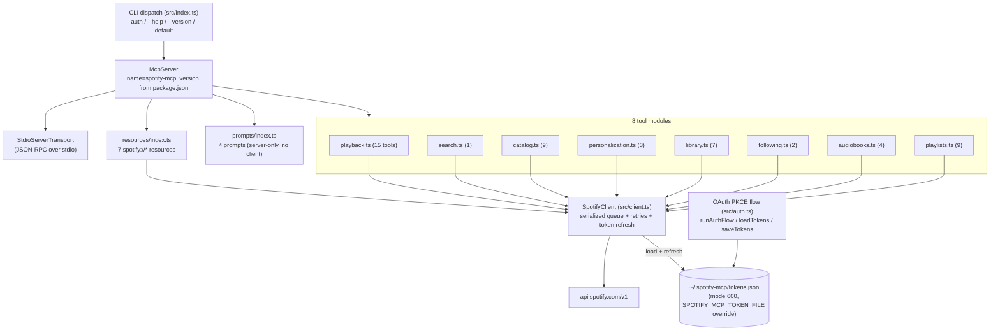
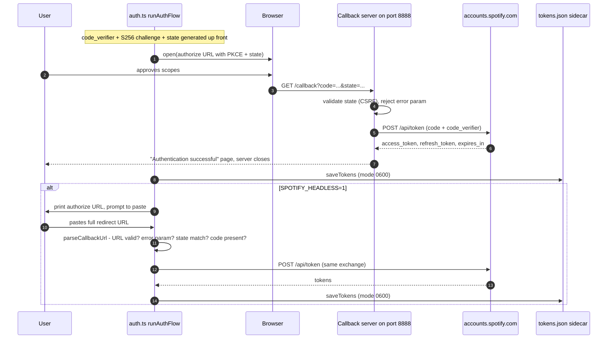

# Architecture

How SpotifyMCP actually works, distilled from the source under `src/`. For the *what* (goals, contracts, full endpoint inventory), read [SPEC.md](SPEC.md); this document is the how-it-works companion and cross-references the spec where relevant.

## Component map

`index.ts` wires everything at startup: it creates one `SpotifyClient`, passes that single shared instance to all eight tool modules and to `registerResources`, registers four prompts directly on the `McpServer` (prompts never touch the client), then connects a `StdioServerTransport`. Running `spotify-mcp auth` instead runs `runAuthFlow()` from `auth.ts` and exits.

## Authentication flows

Both flows share the same PKCE primitives (`code_verifier` = base64url of 32 random bytes, `S256` challenge, random 16-byte `state`) and the same token exchange against `https://accounts.spotify.com/api/token`. The redirect URI defaults to `http://127.0.0.1:8888/callback` (`SPOTIFY_REDIRECT_URI` overrides).

The headless branch exists because the callback listener binds `127.0.0.1` on the machine running the MCP server — useful when that machine is remote (homelab, CI, agent runtime) and the operator's browser is elsewhere. `parseCallbackUrl` is a pure exported function so the state/error/code validation is unit-testable without network.

Tokens live in `~/.spotify-mcp/tokens.json` by default, written with mode `0o600` (plus a best-effort `chmod` that tightens pre-existing loose files and is allowed to fail on Windows).

## Request pipeline

Every HTTP call funnels through one private path inside `SpotifyClient`:

1. **Serialization** — `get`/`post`/`put`/`putRaw`/`delete` wrap their work in `enqueue()`: a promise-chain queue (`this._queue.then(...)`) so requests are issued strictly one at a time. A rejection is swallowed when re-linking the chain so one failure cannot poison subsequent calls.
2. **Inter-request gap** — before each request fires, the worker sleeps until at least 100 ms have passed since the previous request started.
3. **Rate-limit hold** — after any 429, `_rateLimitUntil` is set to now + `Retry-After` seconds; every later queued request additionally waits out that deadline. The 429 response itself is **retried once** (per call, `retryCount === 0` guard), sleeping the full `Retry-After` first (defaulting to 1 s if the header is missing/unparsable).
4. **Token freshness** — `ensureValidToken()` proactively refreshes when `Date.now()` is within 60 s of `expires_at`. If a call nonetheless comes back **401**, the client refreshes and retries exactly once. Refresh uses the stored `refresh_token`; if Spotify rotates it, the new one is persisted, otherwise the old one is kept. Refresh failure throws `SpotifyApiError` with the message `Token refresh failed — re-run "spotify-mcp auth"`.
5. **Error model** — non-OK responses throw `SpotifyApiError(status, message)` where the message prefers Spotify's own `error.message` from the JSON body verbatim (e.g. "Player command failed: Premium required"). Only when the body is missing, lacks `message`, or isn't JSON does it fall back to `genericMessageFor(status)`: a hint for 403, a not-found line for 404, an availability line for 503, and a generic `"Spotify API error <status>"` otherwise. This ordering is deliberate — earlier revisions rewrote every 403 to "requires Premium", which mislabeled scope/regional/deprecation failures.
6. **Pagination** — `getAllPages<T>()` walks offset-paginated endpoints through the *same* queue (each page is a normal queued `get`). It accumulates items until offset passes the server-reported `total`, the page returns zero items, or the cap is hit — **500 items by default**, overridable via `{ maxItems }` (result sliced to the cap). Cursor-paginated endpoints (e.g. followed artists, which use an `after` cursor) are explicitly unsupported by this helper.
7. **No timeouts** — the underlying `fetch` calls carry no `AbortSignal`, so a hung connection stalls its slot in the queue indefinitely (see [Known design tensions](#known-design-tensions)).

## Tool and response layer

Each `register*Tools(server, client)` function calls `server.tool(name, description, zodShape, handler)`:

- **Input validation** — per-tool zod schemas (strings, enums with `.default(...)`, `.optional()` flags, `.describe(...)` help text). The SDK validates arguments before the handler runs.
- **Handlers** — thin orchestration: one or more `client.get/post/put/delete/getAllPages` calls against typed response shapes from `src/types/spotify.ts`.
- **Output formatting** — handlers return plain text content blocks (`{ content: [{ type: 'text', text }] }`). Formatting helpers like `formatDuration(ms)` and `formatItem(track|episode)` render human-readable lines (title, artists/show, progress, URI) rather than dumping JSON.
- **Transport** — the MCP SDK's `StdioServerTransport` carries JSON-RPC between the host (e.g. Claude Desktop) and this process; nothing else listens on the network during normal operation.

Resources follow the same pattern via `server.resource(name, 'spotify://…', { description }, reader)` for seven `spotify://` URIs (profile, player state, queue, top tracks/artists, recently played, playlists). Prompts (`server.prompt`) return canned user-message templates referencing real tool names; they take only the `server`, never the client.

## Module map

| File | Responsibility | Approx LOC |
|---|---|---|
| `src/index.ts` | CLI dispatch (`auth` / `--help` / `--version` / start server), wiring all registrations onto one `McpServer` + stdio transport | ~72 |
| `src/client.ts` | `SpotifyClient`: serialized request queue, 100 ms gap, 429/401 retry-once logic, token refresh, pagination walker, `SpotifyApiError` | ~277 |
| `src/auth.ts` | PKCE generation, browser + headless OAuth flows, callback HTTP server on 127.0.0.1:8888, `loadTokens`/`saveTokens` (mode 0600), exported pure `parseCallbackUrl` | ~309 |
| `src/tools/playback.ts` | 15 tools: play/pause/skip/volume/shuffle/repeat/queue/devices/now-playing/search-and-play | ~383 |
| `src/tools/playlists.ts` | 9 tools: create/list/modify playlists, add/remove tracks, cover upload (via `putRaw`) | ~352 |
| `src/tools/catalog.ts` | 9 tools: albums, artists, shows/episodes metadata lookups | ~318 |
| `src/tools/library.ts` | 7 tools: saved tracks/albums/shows check + save/remove | ~292 |
| `src/resources/index.ts` | 7 `spotify://*` resources (profile, player state, queue, top lists, recently played, playlists) | ~212 |
| `src/types/spotify.ts` | Hand-written response shapes: `TokenData`, `SpotifyPaged`, track/album/artist/episode/device types | ~406 |
| `src/tools/audiobooks.ts` | 4 tools: audiobook/author lookup + library management | ~181 |
| `src/tools/personalization.ts` | 3 tools: top tracks/artists (time-range parameterized), recently played | ~147 |
| `src/tools/search.ts` | 1 multi-type search tool | ~146 |
| `src/prompts/index.ts` | 4 prompts: dj, playlist-from-mood, music-taste summary, discovery alternative | ~67 |
| `src/tools/following.ts` | 2 tools: followed-artists list + follow/unfollow | ~83 |

Totals: 50 tools across 8 modules, 7 resources, 4 prompts.

## Known design tensions

Documented honestly; tracked against the open audit epic [#33 — v1.0.4 bug + security batch](https://github.com/NovaLux12/spotify-mcp-server/issues/33):

- **No fetch timeout** — `rawRequest` and the token-exchange/refresh calls use bare `fetch` with no `AbortSignal`. Because the queue serializes requests, a single hung connection blocks every subsequent tool call. This is the highest-priority finding in #33.
- **Non-atomic token writes** — `saveTokens` writes `tokens.json` in place; there is no temp-file + rename, so a crash mid-write can leave a truncated/corrupt sidecar that `loadTokens` will fail to parse on next startup.
- **Retry budget is per-request, fixed at one** — a second consecutive 429 or 401 surfaces as an error instead of backing off further; acceptable today, worth revisiting under sustained rate limiting.
- **Single-process assumptions** — token refresh reads/writes the sidecar without locking, so two concurrently running server instances can race refreshes and clobber each other's `refresh_token`.

Forward-looking gaps live in the sibling epics: [#31 — endpoint parity](https://github.com/NovaLux12/spotify-mcp-server/issues/31) (wrapping remaining live Web API surface) and [#32 — MCP experience](https://github.com/NovaLux12/spotify-mcp-server/issues/32) (caching, response shaping, safety, resources/prompts expansion).
