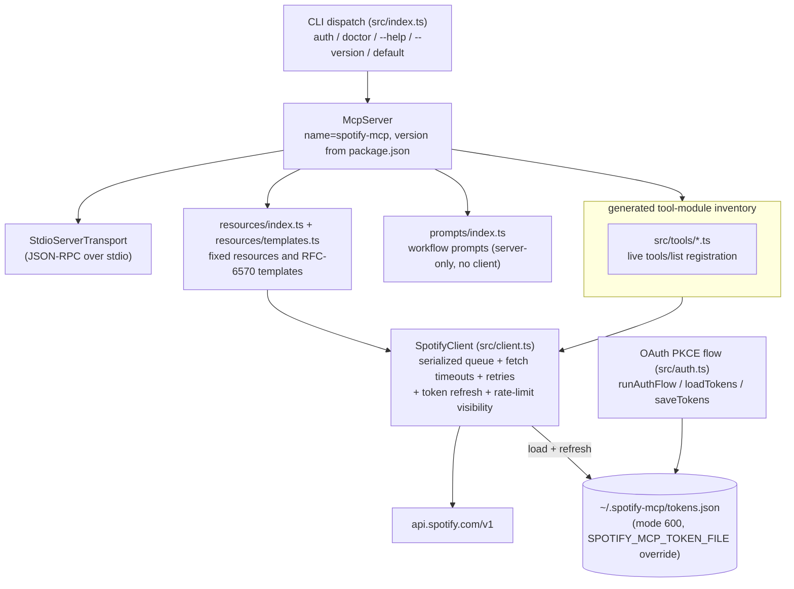
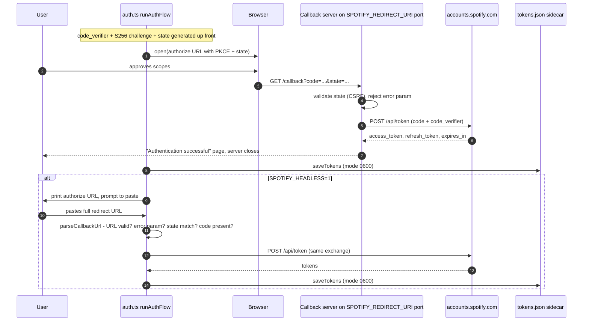
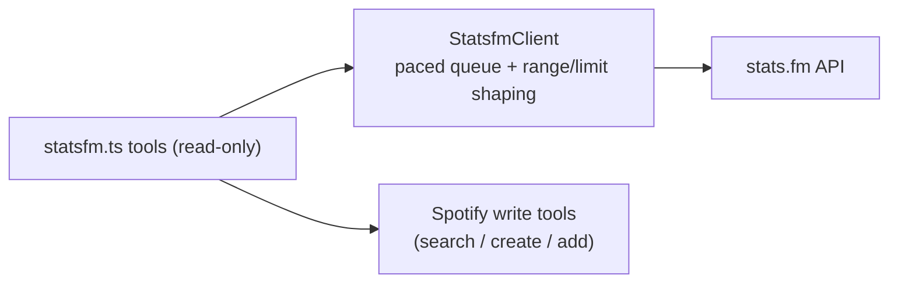

# Architecture

How SpotifyMCP actually works, distilled from the source under `src/`. For the *what* (goals, contracts, full endpoint inventory), read [SPEC.md](SPEC.md); this document is the how-it-works companion and cross-references the spec where relevant.

## Component map

`index.ts` wires everything at startup: it creates one `SpotifyClient`, passes that shared instance to every active tool module and to the resource/prompt registrars, then connects a `StdioServerTransport`. Registration is filtered by the resolved toolset (`SPOTIFY_MCP_TOOLSETS`, with `SPOTIFY_MCP_ENABLE_TOOLS`/`SPOTIFY_MCP_DISABLE_TOOLS` overrides) and, where applicable, granted Spotify scopes. `spotify_doctor` and the discovery trio (`find_tool`, `inspect_tool`, `toolset_report`) register outside toolset trimming; the trio is the discovery escape hatch for minimal toolsets and remains subject to the catalog scope gate. `verify_receipt` is read-only but is not unconditional: it registers under the `library` key.

## Authentication flows

Both flows share the same PKCE primitives (`code_verifier` = base64url of 32 random bytes, `S256` challenge, random 16-byte `state`) and the same token exchange against `https://accounts.spotify.com/api/token`. The redirect URI defaults to `http://127.0.0.1:8888/callback`; `SPOTIFY_REDIRECT_URI` overrides it, and the callback server's bind port and route path are **derived from that value** (#14), so an override such as `http://127.0.0.1:9000/callback` is honoured end-to-end.

The headless branch exists because the callback listener binds `127.0.0.1` on the machine running the MCP server — useful when that machine is remote (homelab, CI, agent runtime) and the operator's browser is elsewhere. `parseCallbackUrl` is a pure exported function so the state/error/code validation is unit-testable without network. When the browser flow rejects a callback carrying an OAuth `error` param, the failure page interpolates that value through `escapeHtml` before echoing it back (#19), so a crafted redirect cannot inject markup.

Tokens live in `~/.spotify-mcp/tokens.json` by default (`SPOTIFY_MCP_TOKEN_FILE` overrides it). Writes are atomic: `saveTokens` writes a `.tmp` sidecar with mode `0o600` and renames it over the target (#109), so a crash mid-write cannot leave a truncated file; granted OAuth scopes are persisted on the token object for the scope gates in `index.ts`.

## Request pipeline

Every HTTP call funnels through one private path inside `SpotifyClient`:
1. **Serialization (two-lane)** — `get`/`post`/`put`/`putRaw`/`delete` wrap their work in `enqueue()`, which lands the task on one of two priority lanes (`normal` for interactive calls, `low` for `getAllPages` walks — see [Request scheduling](#request-scheduling)). Requests are still issued strictly one at a time; a rejection is swallowed when re-linking the chain so one failure cannot poison subsequent calls.
2. **Inter-request gap** — before each request fires, the worker sleeps until at least 100 ms have passed since the previous request started.
3. **Rate-limit hold** — after any 429, `_rateLimitUntil` is set to now + `Retry-After` seconds; every later queued request additionally waits out that deadline. The `Retry-After` header is parsed defensively: absent *or* unparsable values fall back to 1 s, so garbage can no longer poison the deadline with `NaN`. The response body's `error.reason` is inspected: `QUOTA_EXCEEDED` throws immediately (with the quota message), and bursts with `Retry-After` > 10 s fail fast with the wait surfaced in the error; only small bursts are slept off in-queue (`_lastThrottle`) and retried once. Every throttle event is recorded as `_lastThrottle` (`retryAfterSec`, `waitedMs`, timestamp) and surfaced read-only via the `spotify://me/rate-limit` resource, so agents can make informed wait-vs-abort decisions without burning another tool call.
4. **Token freshness** — the token file is read once per client and memoised on a cached promise; a failed load is deliberately *not* memoised, so the next call retries from disk (e.g. after the user re-runs `spotify-mcp auth`). `ensureValidToken()` proactively refreshes when `Date.now()` is within 60 s of `expires_at`. If a call nonetheless comes back **401**, the client refreshes and retries exactly once; if that refresh throws, the original **401** is what surfaces (with the refresh reason in its message), because a failure of the token service says nothing about the caller's arguments (#1007). `doRefreshTokens` first re-reads the token file and adopts a fresher sidecar written by another process (#109); otherwise it refreshes using the stored `refresh_token`, persisting a rotated one if Spotify issues it. Malformed `expires_in` is treated as already expired so a dead token never sticks. Refresh failure throws `SpotifyApiError` with the message `Token refresh failed — re-run "spotify-mcp auth"` for revoked grants — status **401**, not the token endpoint's own 400, so the error boundary reports it as `auth` and not as "invalid arguments" (#1007). Any other token-service failure throws **503** (upstream status kept in the message) for the same reason; transient outages ride out on a still-valid access token.
5. **Fetch timeout** — every outbound call (API requests and the token-exchange/refresh calls alike) carries an `AbortSignal.timeout`, defaulting to 30 s and overridable via `SPOTIFY_REQUEST_TIMEOUT_MS`. An aborted call surfaces as `SpotifyApiError` ("`<METHOD> <url>` timed out after Ns") instead of hanging its queue slot indefinitely.
6. **Error model** — non-OK responses throw `SpotifyApiError(status, message)` where the message prefers Spotify's own `error.message` from the JSON body verbatim (e.g. "Player command failed: Premium required"). Only when the body is missing, lacks `message`, or isn't JSON does it fall back to `genericMessageFor(status)`: a hint for 403, a not-found line for 404, an availability line for 503, and a generic `"Spotify API error <status>"` otherwise. This ordering is deliberate — earlier revisions rewrote every 403 to "requires Premium", which mislabeled scope/regional/deprecation failures. A **304** is the one non-OK status that is not itself a failure: a 304 backed by a stored validator is a successful read answered from the validator (step 10), and only an unbacked one throws.
7. **Pagination** — `getAllPages<T>()` walks offset-paginated endpoints through the *same* two-lane scheduler as a `low`-priority task (each page is a normal queued `get`). It accumulates items until offset passes the server-reported `total`, the page returns zero items, or the cap is hit — the configured fetch-all cap by default (**500**, via `SPOTIFY_MCP_FETCH_ALL_CAP`), overridable per call via `{ maxItems }` (result sliced to the cap). `opts.initialOffset` seeds the cursor so callers resuming mid-list continue where they left off. Each walk carries a monotonic id which `index.ts` forwards as the `progressToken` of MCP `notifications/progress` events (best-effort; a throwing reporter never breaks a walk). Cursor-paginated endpoints (e.g. followed artists, which use an `after` cursor) remain explicit per-call loops.
8. **Read cache (#54)** — `src/cache.ts` provides an `LruTtlCache` (5-minute TTL, LRU eviction by default) plus a bypass policy (`shouldBypassCache`: never cache non-GET requests or volatile `/me/player*` and `/me/top*` paths, which covers recently-played) and a `ValidatorStore` for conditional reads (step 10). `get()` consults the cache before enqueueing and stores successful JSON responses after fetch; every successful mutation calls `afterMutation()`, which drops the whole cache (a mutation may invalidate any cached object) and records the mutation in the opt-in history JSONL.
9. **Request/quota usage tracking (#904)** — the drain path maintains a cumulative counter plus per-request timestamps (pruned to the longest exposed window). `getRateLimitStatus()` exposes `requestsTotal` / `requestsLastMinute` / `requestsLastHour`; cache hits bypass the queue and cost nothing, so they are not counted. Heavy composite scans consult the shared cooldown first (`quotaPreflight`: blocked scans return an actionable wait message and issue 0 requests) and otherwise shrink their walk budget to the remaining quota window (`quotaWindowRemaining`), disclosing `requests_made` plus `requests_planned`/`budget_shrunk` in payloads. `spotify_doctor` and the `spotify://me/rate-limit` resource report the same counts.
10. **Conditional reads (#601)** — `src/cache.ts` also provides a `ValidatorStore`: for every response carrying an `ETag`, the payload and its tag are kept per cache key (default 1-hour validator window, LRU-bounded, dropped wholesale by `afterMutation()`). The next read of that key sends `If-None-Match`. `rawRequest` returns **304** before the `!res.ok` error mapping — it is a successful conditional read, not a failure — and `get()` answers it from the validator, refreshes the entry's timestamp, and fires `opts.onNotModified` so a watch loop can branch (`unchanged: true` in the `structuredContent` of the `get_now_playing` / `get_currently_playing` polls). A stored payload is never served unvalidated: on volatile paths the request still goes out every time, and only the 304 short-circuits the body. A body that arrives without an `ETag` supersedes the stored validator, and a 304 with no validator behind it — which cannot be answered honestly — throws `SpotifyApiError(304, …)` carrying the reason `NOT_MODIFIED_WITHOUT_VALIDATOR`, because the error boundary has no 304 case of its own and would otherwise report an unnamed internal failure a host can do nothing with (#1007's lesson). Poll recipe: [Cookbook §11](docs/cookbook.md).

## Second upstream: stats.fm (v2 — implemented)

Spotify is the system of record for playback, library, and catalog. stats.fm rides alongside as a **second upstream** for lifetime listening history, cross-range top lists, and taste aggregates. The network-backed `src/tools/statsfm.ts` and `src/tools/statsfm_taste.ts` tools are read-only; the local `statsfm_record_feedback`/`record_feedback` tools write only process memory. They share the response-shaping contract (`response_format`, `max_results`, `structuredContent`); network tools have no `dry_run`, receipts, or history JSONL. Identity is a stats.fm user ID, not OAuth. Full guide: `docs/statsfm.md`.

## Tool and response layer

Each `register*Tools(server, client)` function calls `server.tool(...)` or, for tools needing richer metadata, `server.registerTool(...)`:

- **Input validation** — per-tool zod schemas (strings, enums with `.default(...)`, `.optional()` flags, `.describe(...)` help text). The SDK validates arguments before the handler runs.
- **Handlers** — thin orchestration: one or more `client.get/post/put/delete/getAllPages` calls against typed response shapes from `src/types/spotify.ts`.
- **Mutation conformance guard (#920)** — `tests/mutations.conformance.test.ts` enumerates the live registry via `tools/list` and asserts every write-capable tool exposes `dry_run` and `response_format` unless allowlisted with a one-line reason (local sidecars only); known gaps pending sibling slices are pinned in `KNOWN_MISSING_*` lists.
- **Output formatting** — every tool takes a `response_format` parameter (`'concise'` default, `'detailed'`, or `'json'`): concise renders human-readable lines via helpers like `formatDuration(ms)` and `formatItem(track|episode)`; detailed adds context; json returns a machine-readable payload. List tools take `max_results` (default `SPOTIFY_MCP_MAX_ITEMS`) and attach `structuredContent` plus pagination info; the walk-bounded scans return their whole `SPOTIFY_MCP_FETCH_ALL_CAP` walk instead and disclose `fetch_all_cap`/`truncated_by_cap` when the bound bites; destructive ops take `dry_run` and mutations emit batch summaries.
- **Transport** — the MCP SDK's `StdioServerTransport` carries JSON-RPC between the host (e.g. Claude Desktop) and this process; nothing else listens on the network during normal operation.

Resources are registered through `server.resource(...)` as fixed `spotify://` URIs and RFC-6570 templates. Every fixed URI has a `{?format=json}` twin; playlist tracks and catalog entities also have query-absorbing twins where required. The generated inventory below is derived from `resources/list` and `resources/templates/list`, so it includes saved tracks/audiobooks, following, history, and genre heatmap resources without a second hand-maintained list.

## Module map

<!-- BEGIN:generated surface-census -->
The finalized default MCP registry exposes **592 tools**, **16 fixed resources**, **33 resource templates**, and **14 prompts**. Toolsets and production gates can trim a configured host; these totals describe the default production `tools/list` after finalizers. The tool surface is attributed to 66 files under `src/tools/`.
<!-- END:generated surface-census -->

The table is generated from every TypeScript file recursively under `src/`, including nested `lib/`, `resources/`, `prompts/`, `tools/`, and `types/` modules. Tool counts come from real registrations (including loop factories), and LOC is the repository line count, not an estimate.

<!-- BEGIN:generated module-map -->
| File | Responsibility | LOC |
|---|---|---:|
| `src/auth.ts` | Runtime module for src/auth.ts. (0 registered tools) | 631 |
| `src/cache.ts` | Tiny LRU + TTL cache used by SpotifyClient for immutable catalog reads (#54). (0 registered tools) | 204 |
| `src/chunk.ts` | The batch-size policy for the whole server, in one place (#512, #583). (0 registered tools) | 45 |
| `src/client.ts` | Runtime module for src/client.ts. (0 registered tools) | 1008 |
| `src/config.ts` | Central configuration loader for the SPOTIFY_MCP_* environment family. (0 registered tools) | 227 |
| `src/csvsafe.ts` | CSV cell rendering shared by every writer that emits a spreadsheet (#630). (0 registered tools) | 32 |
| `src/gating.ts` | The app-registration-gated error contract (#791, #428, #429; audit A14-016/A8-036) -- the graceful 403 mapping for Spotify's app-registration-gated endpoint family (probed 2026-08-26, memory/edge-probe-2026-08-26.json). (0 registered tools) | 151 |
| `src/history.ts` | Opt-in mutation history JSONL (#64, hardened in #628). (0 registered tools) | 375 |
| `src/index.ts` | Runtime module for src/index.ts. (0 registered tools) | 275 |
| `src/lib/statsfm-client.ts` | Minimal client for the public stats.fm API (https://api.stats.fm/api/v1). (0 registered tools) | 138 |
| `src/markets.ts` | Runtime module for src/markets.ts. (0 registered tools) | 165 |
| `src/paths.ts` | Local-path confinement for export/import tools (#622). (0 registered tools) | 346 |
| `src/prompts/index.ts` | Runtime module for src/prompts/index.ts. (0 registered tools) | 311 |
| `src/receipts.ts` | Mutation receipts (#112 idea 11). (0 registered tools) | 742 |
| `src/refs.ts` | Shared Spotify reference parser and resolver. (0 registered tools) | 229 |
| `src/resources/index.ts` | Runtime module for src/resources/index.ts. (0 registered tools) | 869 |
| `src/resources/templates.ts` | RFC-6570 resource templates over single-get catalog endpoints (#111, pattern 2). (0 registered tools) | 321 |
| `src/scopefilter.ts` | Scope-aware module gating (#111 item 6). (0 registered tools) | 78 |
| `src/shaping.ts` | Shared shaping helpers for tool responses (#51/#52/#53/#57/#58): zod schema fragments, truncation math, pagination info, structuredContent emission, mutation batch summaries and dry-run descriptions. (0 registered tools) | 900 |
| `src/tools/analytics.ts` | Runtime module for src/tools/analytics.ts. (4 registered tools) | 484 |
| `src/tools/annotations.ts` | MCP tool annotations (#565 / A0-002, A4-005). (1 registered tool) | 1266 |
| `src/tools/artistwatch.ts` | Runtime module for src/tools/artistwatch.ts. (6 registered tools) | 867 |
| `src/tools/audiobookcopilot.ts` | Audiobook chapter copilot (#112 idea 4): tools for navigating long-form audiobooks — full chapter tables regardless of the ~18-chapter app break (bounded by the fetch-all cap, and the bound is disclosed), 1-based chapter jumps, and "where was I?" (3 registered tools) | 396 |
| `src/tools/audiobooks.ts` | Runtime module for src/tools/audiobooks.ts. (4 registered tools) | 425 |
| `src/tools/backup.ts` | Library backup (#159): snapshot the entire reachable library — liked tracks, saved albums/shows/episodes/audiobooks, followed artists and every playlist (with items) — into a timestamped local JSON file plus a bounded metadata sidecar used by list_backups. (2 registered tools) | 1335 |
| `src/tools/backup_delete.ts` | `delete_backup` — the one destructive tool in the library backup family (#1017), split out of backup.ts so the manifest can give it its own row. (1 registered tool) | 155 |
| `src/tools/backupfirst.ts` | backup_first (#216): pre-flight snapshot for account-wide destructive tools. (1 registered tool) | 88 |
| `src/tools/browse.ts` | Runtime module for src/tools/browse.ts. (3 registered tools) | 200 |
| `src/tools/catalog.ts` | Runtime module for src/tools/catalog.ts. (31 registered tools) | 1500 |
| `src/tools/confirm.ts` | Elicitation-gated confirmation for destructive playlist operations (#111 item 5). (0 registered tools) | 191 |
| `src/tools/doctortool.ts` | spotify_doctor (#111 idea 9 + #228): the CLI `doctor` command (runDoctor in index.ts) as an in-server TOOL so MCP agents can self-diagnose the most common failure class — missing/expired tokens, scope gaps between the auth-time grant and the write tools exposed by the active toolsets, Premium gating they cannot introspect, and an active rate-limit cooldown. (1 registered tool) | 697 |
| `src/tools/episodemgmt.ts` | episodemgmt (#204, #187, #230): archive_played_episodes. mark_episode_played was removed in #230 — PUT /me/episodes/{id} with resume_point is not a real Spotify endpoint (real endpoint is PUT /me/episodes? (1 registered tool) | 273 |
| `src/tools/exhaust2_catalog.ts` | exhaust2 catalog slice — feature swarm v1.24.0 (issues #332–#357). (19 registered tools) | 1479 |
| `src/tools/exhaust2_enggating.ts` | exhaust2 enggating slice -- now a registration placeholder only (#791). (0 registered tools) | 40 |
| `src/tools/exhaust2_extra.ts` | exhaust2 extra slice — the final three playlists-surface tools (#398-#400). (3 registered tools) | 558 |
| `src/tools/exhaust2_misc.ts` | exhaust2 misc slice — feature swarm v1.24.0. (27 registered tools) | 1793 |
| `src/tools/exhaust2_playback.ts` | exhaust2 playback slice — feature swarm v1.24.0 (issues #358-#379). (23 registered tools) | 1349 |
| `src/tools/exhaust2_playlists.ts` | exhaust2 playlists slice — feature swarm v1.24.0 (issues #380–#400). (18 registered tools) | 1753 |
| `src/tools/exhaustmisc.ts` | exhaustmisc — mop-up for the 60-issue exhaustive sweep. (10 registered tools) | 625 |
| `src/tools/export.ts` | export_playlist (#155): dump a playlist's full item list as an M3U or CSV document — either written to a local file (mode 0600) or returned inline (truncated at max_results rows with a footer noting the full length). (1 registered tool) | 396 |
| `src/tools/following.ts` | Runtime module for src/tools/following.ts. (5 registered tools) | 473 |
| `src/tools/freshness.ts` | freshness radar (#112 idea 2): personal replacement for the removed /browse/new-releases surface. (1 registered tool) | 659 |
| `src/tools/import.ts` | import_playlist (#165): the inverse of export_playlist. (1 registered tool) | 443 |
| `src/tools/library.ts` | Runtime module for src/tools/library.ts. (16 registered tools) | 1299 |
| `src/tools/libraryanalytics.ts` | Runtime module for src/tools/libraryanalytics.ts. (4 registered tools) | 683 |
| `src/tools/libraryhygiene.ts` | Album completion & consolidation hygiene (#112 idea 5). (1 registered tool) | 532 |
| `src/tools/libraryinsights.ts` | Runtime module for src/tools/libraryinsights.ts. (3 registered tools) | 687 |
| `src/tools/personalization.ts` | Runtime module for src/tools/personalization.ts. (3 registered tools) | 283 |
| `src/tools/playback.ts` | Runtime module for src/tools/playback.ts. (16 registered tools) | 958 |
| `src/tools/playbackext.ts` | playbackext (#197, #206, #198, #180, #181): local sidecar persistence for playback states, device naming/volume presets, listening sessions, smart rules, show digest. (13 registered tools) | 656 |
| `src/tools/playbackintel.ts` | playbackintel — exhaustive playback/queue/player intel (#272-283 slice) 12 tools: play_on, queue_next, describe_queue, describe_listening_session, play_at, device_health, seek_relative, playback_timeline, repeat_queue_toggle, now_playing_history, playback_compare_states, peek_next + triage extras: get_playback_context, volume_step, market_availability Each tool notes quota in description (🟢/🟡). (15 registered tools) | 522 |
| `src/tools/playlistbatch.ts` | Playlist batch operations — Stream D (#183, #189, #200). (3 registered tools) | 158 |
| `src/tools/playlistdna.ts` | Runtime module for src/tools/playlistdna.ts. (1 registered tool) | 346 |
| `src/tools/playlistfollow.ts` | Playlist follow/unfollow (#1005), split out of playlistmisc.ts. (2 registered tools) | 128 |
| `src/tools/playlisthealth.ts` | Runtime module for src/tools/playlisthealth.ts. (8 registered tools) | 481 |
| `src/tools/playlistmisc.ts` | Playlist misc (#208): mood-vibe template playlists composed from the user's existing library/top data. pin/unpin (follow/unfollow) moved to playlistfollow.ts: they call /me/library, which authorises a different either-of scope set than the playlist-modify pair this file's tools need (#1005), so they need their own manifest row to be gated honestly. (1 registered tool) | 152 |
| `src/tools/playlistops.ts` | Playlist power tools (#96): merge_playlists, diff_playlists, overlap_playlists. (3 registered tools) | 483 |
| `src/tools/playlists.ts` | Runtime module for src/tools/playlists.ts. (26 registered tools) | 2326 |
| `src/tools/podcastsession.ts` | Podcast session composer (#112 idea 3): greedy-packs the user's saved podcast episodes into a listening session of a fixed length in minutes, then (optionally) starts it on a device. (2 registered tools) | 406 |
| `src/tools/portability.ts` | Portability (#188 + #192 + #238 + #240 + #223 + #220): save_discover_weekly / save_release_radar (archive personalized playlists) + export_library_json / export_followed_artists + export_profile_state/import_profile_state + export_listening_history (11 registered tools) | 1965 |
| `src/tools/queueops.ts` | queueops (#194, #202, #224, #231): queue_playlist + save_queue_as_playlist. queue_reorder / queue_remove / queue_clear were removed in #231 — those endpoints do not exist (only GET and POST /me/player/queue are real). (3 registered tools) | 318 |
| `src/tools/restore.ts` | restore_library_snapshot (#160): STRICTLY ADDITIVE restore of a library snapshot produced by backup_library (#159 contract). (1 registered tool) | 971 |
| `src/tools/saveddedupe.ts` | Saved-track duplicate detection (#156). (1 registered tool) | 525 |
| `src/tools/scenes.ts` | Named playback scenes (#112 ideas 7+12): save/apply/list/delete reusable "profiles" (device + volume + shuffle/repeat + context) stored in a local JSON sidecar at ~/.spotify-mcp/scenes.json (override with SPOTIFY_MCP_SCENES_FILE). (7 registered tools) | 727 |
| `src/tools/search.ts` | Runtime module for src/tools/search.ts. (1 registered tool) | 263 |
| `src/tools/searchdive.ts` | Runtime module for src/tools/searchdive.ts. (1 registered tool) | 282 |
| `src/tools/searchhistory.ts` | searchhistory (#205): search_history + search_rerun (90-day expiry, sidecar). (2 registered tools) | 241 |
| `src/tools/showradar.ts` | show_new_episodes (#173): new-episode radar across saved podcast shows. (1 registered tool) | 396 |
| `src/tools/smart.ts` | create_smart_playlist (#172): rule-based playlist generation from the user's OWN listening data — top tracks, recently played, or saved tracks — with optional artist filtering and per-artist uniqueness. (1 registered tool) | 310 |
| `src/tools/statsfm.ts` | stats.fm tools (read-only): listening stats, tops, catalog and social lookups against the public stats.fm API (https://api.stats.fm/api/v1). (30 registered tools) | 908 |
| `src/tools/statsfm_taste.ts` | stats.fm taste-intelligence slice (v2 taste track). (16 registered tools) | 1127 |
| `src/tools/swarm3_analytics.ts` | swarm3 analytics slice — 500-tool swarm v1.26.0 (issue #442). (24 registered tools) | 1389 |
| `src/tools/swarm3_discovery.ts` | Runtime module for src/tools/swarm3_discovery.ts. (24 registered tools) | 1882 |
| `src/tools/swarm3_library.ts` | swarm3 library slice — feature swarm v1.25.0 (500-tool push, branch swarm3-500-tools). (24 registered tools) | 1467 |
| `src/tools/swarm3_meta.ts` | swarm3 meta slice — 500-tool swarm v1.26.0 (issue #442). (3 registered tools) | 182 |
| `src/tools/swarm3_playback.ts` | Runtime module for src/tools/swarm3_playback.ts. (24 registered tools) | 1448 |
| `src/tools/swarm3_playlistops.ts` | swarm3 playlistops slice — 500-tool swarm v1.26.0 (issue #442). (24 registered tools) | 1782 |
| `src/tools/swarm3_refs.ts` | Curated local Spotify-reference tools (#915). (6 registered tools) | 190 |
| `src/tools/swarm3_shows.ts` | Runtime module for src/tools/swarm3_shows.ts. (24 registered tools) | 1490 |
| `src/tools/swarm3_snapshots.ts` | Runtime module for src/tools/swarm3_snapshots.ts. (24 registered tools) | 1660 |
| `src/tools/swarm3b_discovery.ts` | swarm3b discovery slice (second discovery builder) — 500-tool swarm v1.26.0 (issue #442). (24 registered tools) | 1298 |
| `src/tools/swarm4_playlists.ts` | swarm4 playlists slice — feature swarm v1.25.0 (issues #420–#437). (18 registered tools) | 1690 |
| `src/tools/taste_composites.ts` | Wave-2 taste composites: 10 composite tools over the stats.fm PUBLIC API v1 (no auth), shaping taste data into playlist specs, briefs, and reports. (10 registered tools) | 811 |
| `src/tools/taste_playlist.ts` | `taste_to_playlist` — the one writer in the taste composite family (#1009). (1 registered tool) | 344 |
| `src/tools/undo.ts` | Undo for receipt-driven mutations (#217, #625). (2 registered tools) | 449 |
| `src/tools/users.ts` | Runtime module for src/tools/users.ts. (2 registered tools) | 195 |
| `src/toolsets.ts` | Toolsets (#95): coarse-grained grouping of registration entry points so an operator can trim the server's exposed surface via `SPOTIFY_MCP_TOOLSETS` (e.g. "playback,library" for a car dashboard, or "catalog,personalization" for a read-only recommender). (0 registered tools) | 232 |
| `src/types/spotify.ts` | Token storage schema (0 registered tools) | 550 |
<!-- END:generated module-map -->

## Request scheduling

Inside `SpotifyClient`, the old single FIFO queue is now a **two-lane scheduler** (#133): each enqueued request carries a priority — `normal` for interactive tool calls, `low` for background walks like `getAllPages`. The drain loop picks via `selectNextLaneTask`: a normal task wins unless the oldest low task has been waiting ≥ `LOW_AGING_MS` (**15 s**), in which case it is promoted so bulk pagination can never starve quick reads indefinitely. FIFO order holds within a lane, and pacing (100 ms gap) and rate-limit holds apply to every task regardless of lane.

Resolved design tensions (historical)

All previously listed tensions are resolved — kept here as a record:

- ~~Non-atomic token writes~~ — **resolved** (#109): `saveTokens` writes a `.tmp` file with mode `0600` and `rename`s it over `tokens.json` (POSIX rename is atomic).
- ~~Single-process refresh race~~ — **mitigated** (#109): `doRefreshTokens` re-reads `TOKEN_FILE` before refreshing and adopts a fresher sidecar if present. No file lock, so two simultaneous refreshes can both hit the network, but neither clobbers a fresher file. `invalid_grant` → "re-run auth"; transient 5xx rides out on a still-valid token.
- ~~Retry budget is per-request, fixed at one~~ — **changed** (#133-era 429 handling): `QUOTA_EXCEEDED` throws immediately; burst limits with `Retry-After` > 10 s fail fast; only small bursts (≤10 s) are slept and retried. `_rateLimitUntil` still gates every later enqueued request.

Interactive starvation is addressed by the two-lane scheduler above. Throttle visibility is served centrally by the `spotify://me/rate-limit` resource and `spotify_doctor` — `takeThrottleNotice()` remains exported for embedders.

