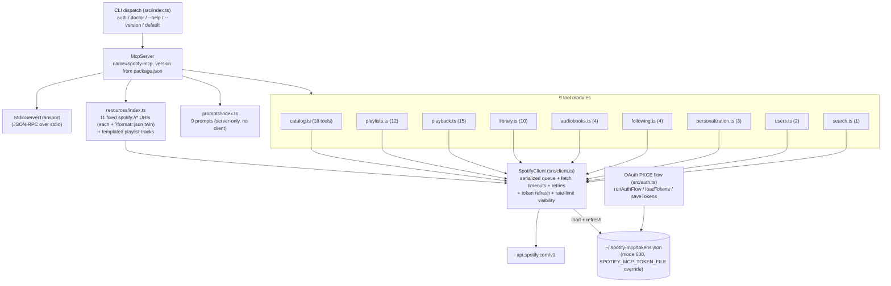
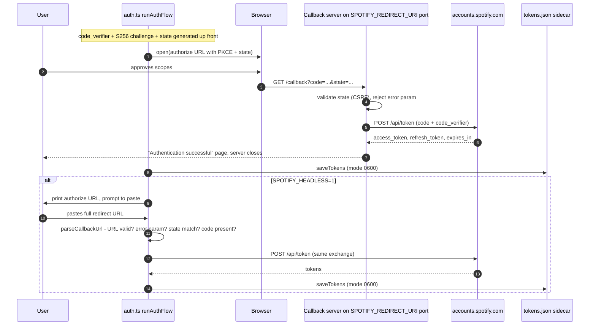

# Architecture

How SpotifyMCP actually works, distilled from the source under `src/`. For the *what* (goals, contracts, full endpoint inventory), read [SPEC.md](SPEC.md); this document is the how-it-works companion and cross-references the spec where relevant.

## Component map

`index.ts` wires everything at startup: it creates one `SpotifyClient`, passes that single shared instance to all nine tool modules and to `registerResources`, registers nine prompts directly on the `McpServer` (prompts never touch the client), installs a pagination-progress forwarder that turns client page-walk events into MCP progress notifications, then connects a `StdioServerTransport`. Running `spotify-mcp auth` instead runs `runAuthFlow()` from `auth.ts` and exits; `spotify-mcp doctor` (#62) builds a short-lived cache-disabled client to check config, token state, and live API access.

## Authentication flows

Both flows share the same PKCE primitives (`code_verifier` = base64url of 32 random bytes, `S256` challenge, random 16-byte `state`) and the same token exchange against `https://accounts.spotify.com/api/token`. The redirect URI defaults to `http://127.0.0.1:8888/callback`; `SPOTIFY_REDIRECT_URI` overrides it, and the callback server's bind port and route path are **derived from that value** (#14), so an override such as `http://127.0.0.1:9000/callback` is honoured end-to-end.

The headless branch exists because the callback listener binds `127.0.0.1` on the machine running the MCP server — useful when that machine is remote (homelab, CI, agent runtime) and the operator's browser is elsewhere. `parseCallbackUrl` is a pure exported function so the state/error/code validation is unit-testable without network. When the browser flow rejects a callback carrying an OAuth `error` param, the failure page interpolates that value through `escapeHtml` before echoing it back (#19), so a crafted redirect cannot inject markup.

Tokens live in `~/.spotify-mcp/tokens.json` by default, written with mode `0o600` (plus a best-effort `chmod` that tightens pre-existing loose files and is allowed to fail on Windows).

## Request pipeline

Every HTTP call funnels through one private path inside `SpotifyClient`:

1. **Serialization** — `get`/`post`/`put`/`putRaw`/`delete` wrap their work in `enqueue()`: a promise-chain queue (`this._queue.then(...)`) so requests are issued strictly one at a time. A rejection is swallowed when re-linking the chain so one failure cannot poison subsequent calls.
2. **Inter-request gap** — before each request fires, the worker sleeps until at least 100 ms have passed since the previous request started.
3. **Rate-limit hold** — after any 429, `_rateLimitUntil` is set to now + `Retry-After` seconds; every later queued request additionally waits out that deadline. The `Retry-After` header is parsed defensively: absent *or* unparsable values fall back to 1 s, so garbage can no longer poison the deadline with `NaN`. The 429 response itself is **retried once** (per call, `retryCount === 0` guard), sleeping the full `Retry-After` first. Every throttle event is recorded as `_lastThrottle` (`retryAfterSec`, `waitedMs`, timestamp) and surfaced read-only via the `spotify://me/rate-limit` resource, so agents can make informed wait-vs-abort decisions without burning another tool call.
4. **Token freshness** — the token file is read once per client and memoised on a cached promise; a failed load is deliberately *not* memoised, so the next call retries from disk (e.g. after the user re-runs `spotify-mcp auth`). `ensureValidToken()` proactively refreshes when `Date.now()` is within 60 s of `expires_at`. If a call nonetheless comes back **401**, the client refreshes and retries exactly once. Refresh uses the stored `refresh_token`; if Spotify rotates it, the new one is persisted, otherwise the old one is kept. Refresh failure throws `SpotifyApiError` with the message `Token refresh failed — re-run "spotify-mcp auth"`.
5. **Fetch timeout** — every outbound call (API requests and the token-exchange/refresh calls alike) carries an `AbortSignal.timeout`, defaulting to 30 s and overridable via `SPOTIFY_REQUEST_TIMEOUT_MS`. An aborted call surfaces as `SpotifyApiError` ("`<METHOD> <url>` timed out after Ns") instead of hanging its queue slot indefinitely.
6. **Error model** — non-OK responses throw `SpotifyApiError(status, message)` where the message prefers Spotify's own `error.message` from the JSON body verbatim (e.g. "Player command failed: Premium required"). Only when the body is missing, lacks `message`, or isn't JSON does it fall back to `genericMessageFor(status)`: a hint for 403, a not-found line for 404, an availability line for 503, and a generic `"Spotify API error <status>"` otherwise. This ordering is deliberate — earlier revisions rewrote every 403 to "requires Premium", which mislabeled scope/regional/deprecation failures.
7. **Pagination** — `getAllPages<T>()` walks offset-paginated endpoints through the *same* queue (each page is a normal queued `get`). It accumulates items until offset passes the server-reported `total`, the page returns zero items, or the cap is hit — the configured fetch-all cap by default (**500**, via `SPOTIFY_MCP_FETCH_ALL_CAP`), overridable per call via `{ maxItems }` (result sliced to the cap). `opts.initialOffset` seeds the cursor so callers resuming mid-list continue where they left off. Each walk carries a monotonic id which `index.ts` forwards as the `progressToken` of MCP `notifications/progress` events (best-effort; a throwing reporter never breaks a walk). Cursor-paginated endpoints (e.g. followed artists, which use an `after` cursor) remain explicitly unsupported by this helper.
8. **Read cache (#54)** — `src/cache.ts` provides an `LruTtlCache` (5-minute TTL, LRU eviction by default) plus a bypass policy (`shouldBypassCache`: never cache non-GET requests or volatile `/me/player*` and `/me/top*` paths, which covers recently-played). `get()` consults the cache before enqueueing and stores successful JSON responses after fetch; every successful mutation calls `afterMutation()`, which drops the whole cache (a mutation may invalidate any cached object) and records the mutation in the opt-in history JSONL.

## Tool and response layer

Each `register*Tools(server, client)` function calls `server.tool(...)` or, for tools needing richer metadata, `server.registerTool(...)`:

- **Input validation** — per-tool zod schemas (strings, enums with `.default(...)`, `.optional()` flags, `.describe(...)` help text). The SDK validates arguments before the handler runs.
- **Handlers** — thin orchestration: one or more `client.get/post/put/delete/getAllPages` calls against typed response shapes from `src/types/spotify.ts`.
- **Output formatting** — every tool takes a `response_format` parameter (`'concise'` default, `'detailed'`, or `'json'`): concise renders human-readable lines via helpers like `formatDuration(ms)` and `formatItem(track|episode)`; detailed adds context; json returns a machine-readable payload. List tools take `max_results` (default `SPOTIFY_MCP_MAX_ITEMS`) and attach `structuredContent` plus pagination info; destructive ops take `dry_run` and mutations emit batch summaries.
- **Transport** — the MCP SDK's `StdioServerTransport` carries JSON-RPC between the host (e.g. Claude Desktop) and this process; nothing else listens on the network during normal operation.

Resources follow the same pattern via `server.resource(name, uri|template, { description }, reader)` for **eleven fixed `spotify://` URIs**: profile, player state, player queue, top tracks/artists, recently played, playlists, saved albums/shows/episodes, and rate-limit status. Each fixed URI is registered twice — once bare (exact-string lookup) and once as a `{?format}` template twin sharing the same renderer, where `?format=json` switches the response to raw JSON. On top of those sits the templated `spotify://playlist/{id}/tracks` resource (with a `{+qs}` twin absorbing any query string), paginated via `?offset`/`?limit`. Prompts (`server.prompt`) return canned user-message templates referencing real tool names — dj, playlist-from-mood, music-taste summary, discovery alternative, playlist audit, listening recap, library migration, podcast catch-up, artist deep dive — and take only the `server`, never the client.

## Module map

| File | Responsibility | Approx LOC |
|---|---|---|
| `src/index.ts` | CLI dispatch (`auth` / `doctor` / `--help` / `--version` / start server), wiring all registrations onto one `McpServer` + stdio transport, pagination-progress forwarding | ~182 |
| `src/tools/catalog.ts` | 18 tools: tracks, albums, artists, shows/episodes, audiobooks metadata, `get_me`, markets, `get_several_*` batch lookups | ~814 |
| `src/tools/playlists.ts` | 12 tools: create/get/list/modify playlists, add/remove/reorder/replace items, duplicate finder, cover upload (via `putRaw`) | ~783 |
| `src/tools/playback.ts` | 15 tools: play/pause/skip/seek/volume/shuffle/repeat/queue/devices/now-playing/search-and-play/transfer | ~703 |
| `src/tools/library.ts` | 10 tools: per-type saved lists (`get_saved_*`), bulk save/remove/check, URI-based save/remove/check-in-library | ~653 |
| `src/resources/index.ts` | 11 fixed `spotify://*` resources (profile, player state/queue, top lists, recently played, playlists, saved library, rate-limit) each with a `?format=json` twin, plus the templated playlist-tracks resource | ~416 |
| `src/auth.ts` | PKCE generation, browser + headless OAuth flows, callback HTTP server on the port derived from `SPOTIFY_REDIRECT_URI`, HTML-escaped error pages, `loadTokens`/`saveTokens` (mode 0600), exported pure `parseCallbackUrl` | ~347 |
| `src/types/spotify.ts` | Hand-written response shapes: `TokenData`, `SpotifyPaged`, track/album/artist/episode/device types | ~382 |
| `src/tools/audiobooks.ts` | 4 tools: audiobook/chapter lookup + saved-audiobooks list | ~324 |
| `src/tools/personalization.ts` | 3 tools: top tracks/artists (time-range parameterized), recently played | ~267 |
| `src/tools/following.ts` | 4 tools: followed-artists list, following check, follow/unfollow | ~245 |
| `src/tools/search.ts` | 1 multi-type search tool | ~243 |
| `src/shaping.ts` | Shared response plumbing: `ResponseFormat`/`MaxResults`/`DryRun` schemas, truncation, pagination info, `structuredContent` and batch-summary helpers | ~220 |
| `src/prompts/index.ts` | 9 prompts: dj, playlist-from-mood, music-taste summary, discovery alternative, playlist audit, listening recap, library migration, podcast catch-up, artist deep dive | ~202 |
| `src/tools/users.ts` | 2 tools: arbitrary user profile + that user's public playlists | ~167 |
| `src/cache.ts` | `LruTtlCache` (TTL + LRU eviction), `shouldBypassCache` policy, order-insensitive cache keys | ~94 |
| `src/config.ts` | Central loader for the `SPOTIFY_MCP_*` environment family (timeouts, caps, token file, headless, redirect URI, history flags) | ~63 |
| `src/history.ts` | Opt-in mutation-history JSONL writer (`SPOTIFY_MCP_HISTORY`), strict field whitelist | ~56 |

Totals: 69 tools across 9 modules, 11 fixed resources (each with a `?format=json` twin) plus the templated playlist-tracks resource, 9 prompts.

## Known design tensions

Documented honestly. The three launch epics — [#31 — endpoint parity](https://github.com/NovaLux12/spotify-mcp-server/issues/31), [#32 — MCP experience](https://github.com/NovaLux12/spotify-mcp-server/issues/32), and [#33 — v1.0.4 bug + security batch](https://github.com/NovaLux12/spotify-mcp-server/issues/33) — are now **closed** (landed via PR #76), which resolved two of the biggest tensions from earlier revisions:

- ~~No fetch timeout~~ — **resolved**: every outbound `fetch` now carries `AbortSignal.timeout` (30 s default, `SPOTIFY_REQUEST_TIMEOUT_MS`), so a hung connection can no longer stall its serialized queue slot indefinitely.
- Token-load churn — **resolved**: the token file is read once per client and memoised; failed loads are retried from disk on the next call instead of being cached.

Still open:

- **Non-atomic token writes** — `saveTokens` writes `tokens.json` in place; there is no temp-file + rename, so a crash mid-write can leave a truncated/corrupt sidecar that `loadTokens` will fail to parse on next startup.
- **Retry budget is per-request, fixed at one** — a second consecutive 429 or 401 surfaces as an error instead of backing off further; acceptable today, worth revisiting under sustained rate limiting.
- **Single-process assumptions** — token refresh reads/writes the sidecar without locking, so two concurrently running server instances can race refreshes and clobber each other's `refresh_token`.
- **Throttle-notice adoption** — the client exposes `takeThrottleNotice()` for tools to append a "rate-limited, waited Ns" line to results (#56), but individual tool handlers have not adopted it yet; the enriched-error half of #56 and the `spotify://me/rate-limit` resource are live. The TTL read cache (#54) and mutation history (#64), previously dormant, are now wired: `get()` caches immutable reads and mutations clear the cache + append a history record when `SPOTIFY_MCP_HISTORY` is enabled.
